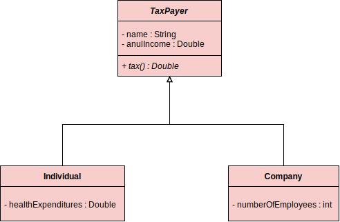

# :sparkles:About the project:sparkles:

### :dart:Description:
Make a program that read data from N taxpayers.  
Taxpayers could be **individual** or **company**.  
Show the tax value paid for each one of them, also the
anual income.

### :magic_wand:Diagram:

  

#### :round_pushpin:Details:
##### Individual:
###### A person who income was lower than 20000.00 pay 15% of tax.
###### A person who income was above 20000.00 pay 25% of tax.
###### Health expenditures have 50% of discount in these expenses on taxes.

##### Company:
###### Companies pay 16% in taxes.
###### If the company have more than 10 employees, they pay 14% in taxes.